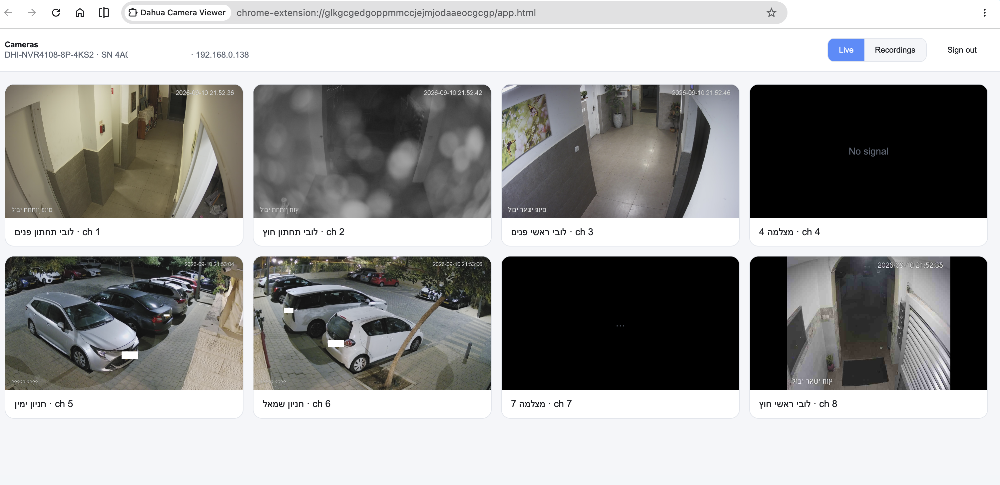
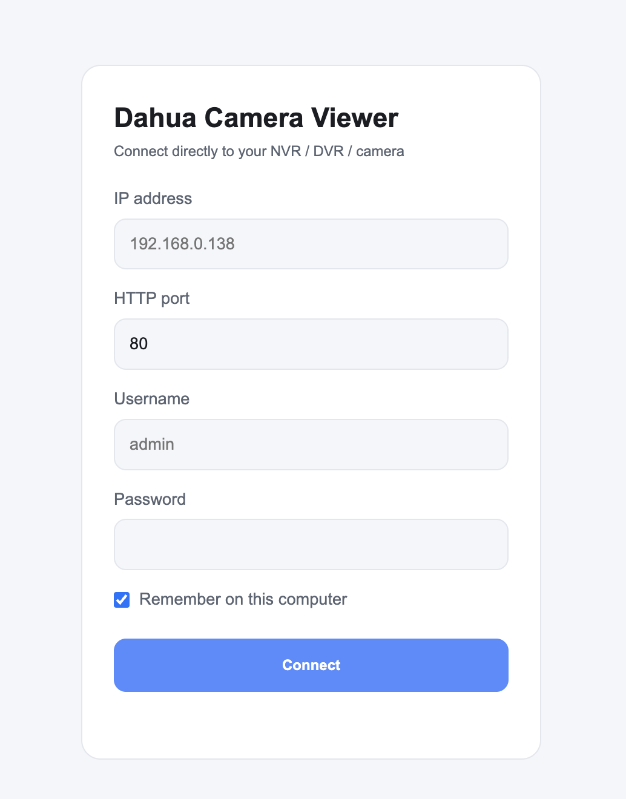
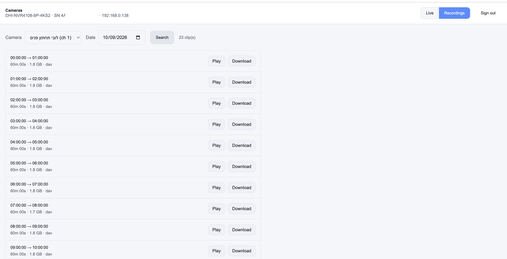

# Dahua Camera Viewer

A **plugin-free, server-free** Chrome extension for viewing Dahua NVRs / DVRs / IP
cameras. It runs entirely in your browser and talks to the device **directly over
your network** — no ffmpeg, no Node backend, no cloud, nothing to install on a server.

It exists because Dahua's own web UI still depends on the ancient `webplugin.pkg`
(NPAPI/ActiveX), which every modern browser removed years ago — so the built-in
web interface simply doesn't play video anymore. A Chrome extension can reach the
device directly because it is allowed to bypass CORS and perform HTTP **Digest
auth** from JavaScript.

  

## Features

- **Live grid** — every channel as a snapshot thumbnail. Nothing streams until you
  ask, so opening the grid doesn't hammer the NVR with 8 simultaneous streams.
  - Hover a tile → **▶** start/stop live for that one camera (MJPEG substream), or
    **⤢** open it fullscreen.
  - Thumbnails show an instant first frame, then upgrade to a sharp full-res
    snapshot in the background.
- **Recordings** — search by camera + date, then either:
  - **Play in the browser** with a real timeline: scrub bar, ⏮/⏭ skip ±1 min,
    play/pause. Only the bytes you actually watch are streamed — no 1.8 GB
    download to see 10 seconds. (H.264 is demuxed from Dahua's `.dav`/DHAV
    container and decoded with the browser's built-in **WebCodecs**.)
  - **Download** the raw `.dav` clip (opens in VLC or Dahua Smart Player).
- **Generic login** — IP, port, username, password. Nothing is hardcoded; it works
  with any Dahua-compatible device. Credentials are optionally remembered in your
  browser profile.
- **Dark / light** theme follows your OS.

  
  &nbsp;&nbsp;
  

## Install

### From source (developer mode)

1. Download / clone this repo.
2. Open `chrome://extensions` in Chrome.
3. Turn on **Developer mode** (top-right).
4. Click **Load unpacked** and select this folder.
5. Click the extension's toolbar icon → the viewer opens in a full tab.

> Chrome Web Store listing: _pending review_ — see [PUBLISHING.md](PUBLISHING.md).

## Setup

1. Open the viewer (toolbar icon).
2. Enter your device's **IP address**, **HTTP port** (usually `80`), **username**
   and **password** — the same credentials you use in the Dahua mobile app.
3. Connect. You'll see the live grid; switch to **Recordings** for playback.

That's it. By default everything happens on your **local network** — the extension
talks to `http://<device-ip>` directly.

## Remote access — do I need port forwarding?

**On your home Wi-Fi: no.** The extension reaches the NVR by its LAN IP directly.

**Away from home:** the browser has to be able to *reach* the NVR somehow. You have
three options, best-first:

| Option | Port forward? | Security | Notes |
|---|---|---|---|
| **VPN into your home** (WireGuard / [Tailscale](https://tailscale.com)) | No | ✅ Best | Install on your router or a Raspberry Pi. Once connected you just use the NVR's normal LAN IP — nothing is exposed to the internet. **Recommended.** |
| **Port forwarding** | Yes | ⚠️ OK if hardened | Forward the NVR's HTTP port on your router to the NVR. Then log in with your public IP (or a dynamic-DNS name). See hardening notes below. |
| **Dahua P2P (Easy4IP / serial number)** | No | ⚠️ Advanced | The "connect by serial number" feature in the mobile app uses Dahua's P2P cloud relay. **Browsers can't speak that protocol.** You'd need a small relay client (e.g. the open-source [`dh-p2p`](https://github.com/keliww/dh-p2p)) running on a home device that re-exposes the NVR as plain HTTP, which this extension can then reach. |

### If you use port forwarding — harden it

Exposing an NVR to the internet is a well-known way to get cameras hijacked. If you
do it:

- Use a **strong, unique admin password** (the default/weak ones are scanned constantly).
- Forward a **non-standard external port**, not 80.
- Prefer the device's **HTTPS** port and enable TLS on the NVR, so credentials
  aren't sent in cleartext. (The extension supports `https://` hosts too.)
- Keep the NVR **firmware up to date**.
- Consider limiting access by source IP on your router if it supports it.

A VPN/Tailscale avoids all of this — the NVR stays completely private.

## Security & privacy

- Your credentials are stored **only** in `chrome.storage.local`, in your own
  Chrome profile on your own machine. They are never sent anywhere except to the
  device IP you enter. See [PRIVACY.md](PRIVACY.md).
- Authentication uses HTTP **Digest** (password is hashed, never sent in the clear).
  Over plain `http://` on your LAN the *video* is unencrypted, which is fine on a
  trusted home network — use HTTPS or a VPN for anything crossing the internet.

## How it works (short version)

- **Digest auth** is implemented in pure JS (`lib/md5.js` + `lib/dahua.js`) because
  the Web Crypto API has no MD5.
- **Live** uses the device's MJPEG substream (`/cgi-bin/mjpg/video.cgi`), parsed
  frame-by-frame (`FFD8…FFD9`) into `` blobs.
- **Recordings** stream a bounded `.dav` window (`loadfile.cgi`), demux the DHAV
  container to Annex-B H.264, and decode with **WebCodecs** onto a `<canvas>`.

More detail for contributors is in [CLAUDE.md](CLAUDE.md).

## Compatibility

Built and tested against a **DHI-NVR4108-8P-4KS2**. Should work with most Dahua and
Dahua-OEM devices that expose the standard HTTP-CGI API (most do). Live view is
limited to whatever the substream provides (typically D1); recordings play at full
resolution.

## License

[MIT](LICENSE) — do whatever you like. Not affiliated with or endorsed by Dahua.
