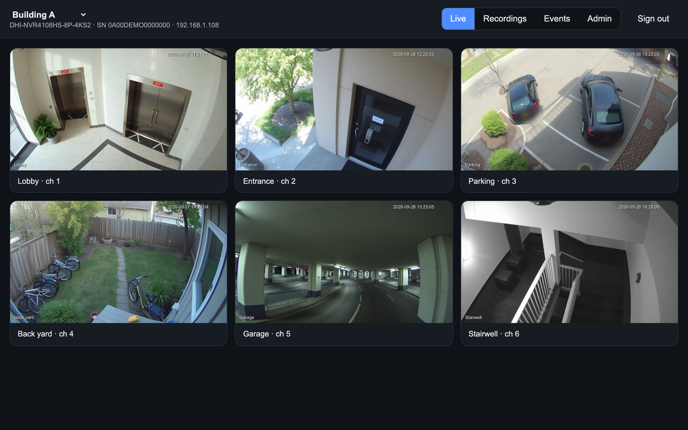
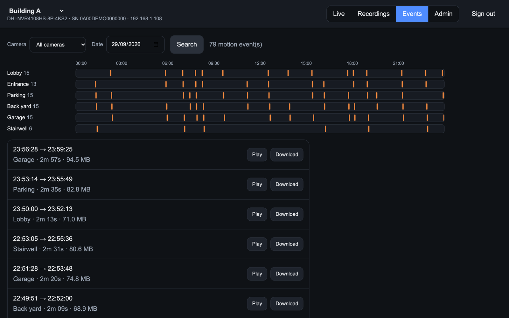
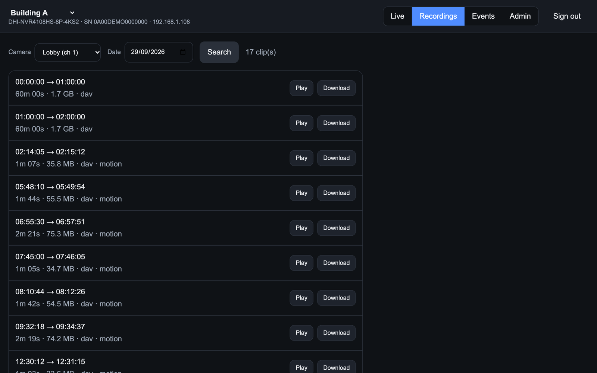
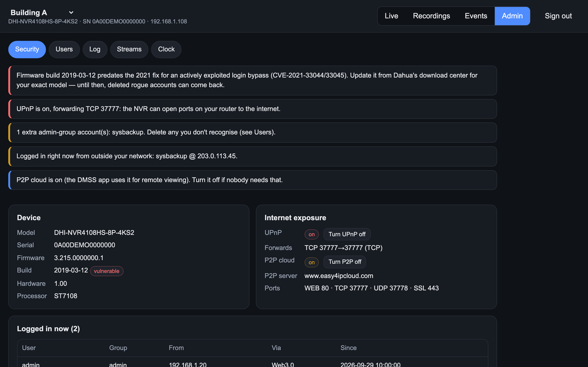
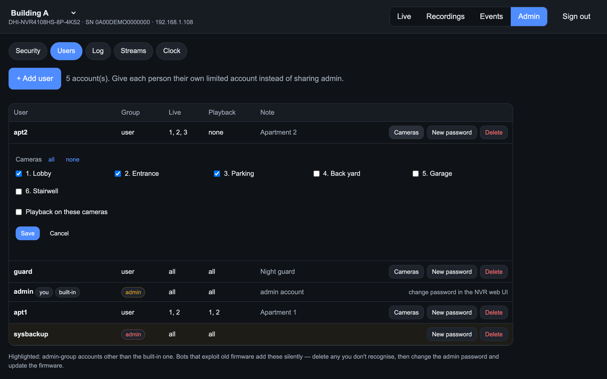
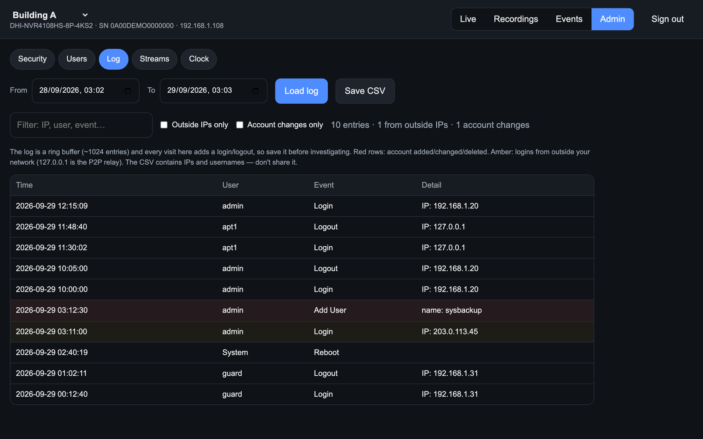
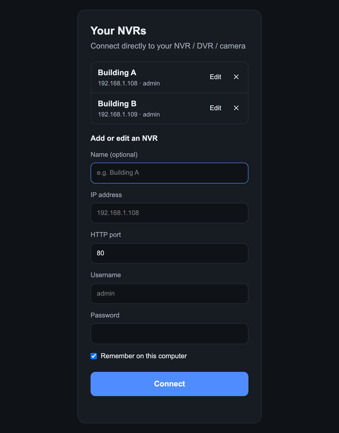

# Dahua Camera Viewer

A **plugin-free, server-free** Chrome extension for viewing Dahua NVRs / DVRs / IP
cameras. It runs entirely in your browser and talks to the device **directly over
your network** — no ffmpeg, no Node backend, no cloud, nothing to install on a server.

It exists because Dahua's own web UI still depends on the ancient `webplugin.pkg`
(NPAPI/ActiveX), which every modern browser removed years ago — so the built-in
web interface simply doesn't play video anymore. A Chrome extension can reach the
device directly because it is allowed to bypass CORS and perform HTTP **Digest
auth** from JavaScript.

  

## Features

- **Live grid** — every channel as a snapshot thumbnail. Nothing streams until you
  ask, so opening the grid doesn't hammer the NVR with 8 simultaneous streams.
  - Hover a tile → **▶** start/stop live for that one camera (MJPEG substream), or
    **⤢** open it fullscreen.
  - Thumbnails show an instant first frame, then upgrade to a sharp full-res
    snapshot in the background.
- **Recordings** — a calendar that marks the days that actually have video, and one
  **24-hour timeline** per day: recorded spans and the NVR's motion marks are drawn
  on it; click or drag anywhere to play from that moment.
  - Zoom 24h / 1h / 10m, hover to see the time, ◀ Motion ▶ jumps between motion
    events (Shift+←/→), ±10 s (←/→), space to pause.
  - **Speed 1×–8× and Max** (as fast as the NVR can stream — about 9× on an
    NVR4108 over a home network) to skim an hour in minutes.
  - Only the bytes you watch are streamed — H.264 is demuxed from Dahua's
    `.dav`/DHAV container and decoded with the browser's built-in **WebCodecs**.
  - **Export MP4**: pick a start and end (up to 20 minutes — the playhead buttons
    make it quick) and save a clip as `.mp4` that plays on any phone or computer.
    The video is copied as recorded, not re-encoded, so it's fast and full quality
    (video only; H.264 cameras).
  - **Download** the raw `.dav` files (open in VLC or Dahua Smart Player).
- **Motion events** — pick a date (one camera or all of them) and see every motion
  alert as marks on a 24-hour strip per camera, plus a newest-first list. Click a
  mark or a row to open that moment on the Recordings timeline; back-to-back clips
  are merged into one event.
  (Uses the NVR's own motion-flagged recordings, so motion recording must be on.)
- **Admin** — manage the NVR itself from the browser:
  - **Security** — firmware age (flags builds vulnerable to the actively exploited
    CVE-2021-33044/33045 login bypass), UPnP port forwards and P2P cloud with
    on/off buttons, who's logged in right now and from where.
  - **Users** — give each person their own limited account (chosen cameras, live
    and optionally playback), change which cameras a user sees, new random
    passwords, delete accounts. Unknown admin-group accounts are highlighted.
  - **Log** — the device log by date range, filtered to outside IPs or account
    changes, with CSV export.
  - **Streams** — per-camera sub-stream codec / FPS / bitrate (what live view uses).
  - **Clock** — NVR vs. computer time, one-click sync, NTP settings.
- **Several NVRs** — save one per building. The login screen lists them for
  one-click connect, and the top-bar dropdown switches between them.
- **Generic login** — IP, port, username, password. Nothing is hardcoded; it works
  with any Dahua-compatible device. It reconnects to the last NVR on open;
  passwords are remembered only if you tick "Remember", and **Sign out** forgets
  just that NVR's password.
- **Report a problem** — one click shows a report (errors, versions, NVR model;
  addresses, serials, usernames and camera names hidden) and opens a pre-filled
  GitHub issue. Nothing is sent unless you submit it.
- **Dark / light** theme follows your OS.

  
  &nbsp;
  

  
  &nbsp;
  

  
  &nbsp;
  

Screenshots use a simulated NVR: made-up camera images, names, serial and addresses.

## Install

### From source (developer mode)

1. Download / clone this repo.
2. Open `chrome://extensions` in Chrome.
3. Turn on **Developer mode** (top-right).
4. Click **Load unpacked** and select this folder.
5. Click the extension's toolbar icon → the viewer opens in a full tab.

> Chrome Web Store listing: _pending review_ — see [PUBLISHING.md](PUBLISHING.md).

## Setup

1. Open the viewer (toolbar icon).
2. Enter your device's **IP address**, **HTTP port** (usually `80`), **username**
   and **password** — the same credentials you use in the Dahua mobile app.
3. Connect. You'll see the live grid; switch to **Recordings** for playback,
   **Events** for motion alerts, or **Admin** to manage the NVR.
4. Another building? Top-bar dropdown → **+ Add NVR…**, and give it a name.

> **Admin changes are real.** Security, Log and the Users list only read, but
> Delete, New password, the UPnP/P2P buttons and Streams/Clock saves change the
> NVR immediately. Most need an admin-group login. The built-in `admin` password
> can't be changed over this API on some firmware — use the NVR's web UI for that.

That's it. By default everything happens on your **local network** — the extension
talks to `http://<device-ip>` directly.

## Remote access — do I need port forwarding?

**On your home Wi-Fi: no.** The extension reaches the NVR by its LAN IP directly.

**Away from home:** the browser has to be able to *reach* the NVR somehow. You have
three options, best-first:

| Option | Port forward? | Security | Notes |
|---|---|---|---|
| **VPN into your home** (WireGuard / [Tailscale](https://tailscale.com)) | No | ✅ Best | Install on your router or a Raspberry Pi. Once connected you just use the NVR's normal LAN IP — nothing is exposed to the internet. **Recommended.** |
| **Port forwarding** | Yes | ⚠️ OK if hardened | Forward the NVR's HTTP port on your router to the NVR. Then log in with your public IP (or a dynamic-DNS name). See hardening notes below. |
| **Dahua P2P (Easy4IP / serial number)** | No | ⚠️ Advanced | The "connect by serial number" feature in the mobile app uses Dahua's P2P cloud relay. **Browsers can't speak that protocol.** You'd need a small relay client (e.g. the open-source [`dh-p2p`](https://github.com/keliww/dh-p2p)) running on a home device that re-exposes the NVR as plain HTTP, which this extension can then reach. |

### If you use port forwarding — harden it

Exposing an NVR to the internet is a well-known way to get cameras hijacked. If you
do it:

- Use a **strong, unique admin password** (the default/weak ones are scanned constantly).
- Forward a **non-standard external port**, not 80.
- Prefer the device's **HTTPS** port and enable TLS on the NVR, so credentials
  aren't sent in cleartext. (The extension supports `https://` hosts too.)
- Keep the NVR **firmware up to date**.
- Consider limiting access by source IP on your router if it supports it.

A VPN/Tailscale avoids all of this — the NVR stays completely private.

## Security & privacy

- Saved NVRs (name, address, username, and the password if you chose "Remember")
  are stored **only** in `chrome.storage.local`, in your own Chrome profile on
  your own machine. They are never sent anywhere except to that NVR. Forgetting
  an NVR also removes the extension's access to its address. See [PRIVACY.md](PRIVACY.md).
- New passwords created in the Admin tab are shown once and never stored. Treat
  the log CSV like the log itself: it contains IPs and usernames.
- Authentication uses HTTP **Digest** (password is hashed, never sent in the clear).
  Over plain `http://` on your LAN the *video* is unencrypted, which is fine on a
  trusted home network — use HTTPS or a VPN for anything crossing the internet.

## How it works (short version)

- **Digest auth** is implemented in pure JS (`lib/md5.js` + `lib/dahua.js`) because
  the Web Crypto API has no MD5.
- **Live** uses the device's MJPEG substream (`/cgi-bin/mjpg/video.cgi`), parsed
  frame-by-frame (`FFD8…FFD9`) into `` blobs.
- **Recordings** stream a bounded `.dav` window (`loadfile.cgi`), demux the DHAV
  container to Annex-B H.264, and decode with **WebCodecs** onto a `<canvas>`.

More detail for contributors is in [CLAUDE.md](CLAUDE.md).

## NVR admin CLI

The Admin tab covers the everyday tasks in the browser. `scripts/nvr.mjs` is the
terminal version (same client, Node 18+), handy for scripting and bulk work such as
`bulkadd apt 1 26`. It manages the NVR itself: create limited per-person accounts instead of sharing the admin
password, reset passwords, read the device log, and check for internet exposure
or unknown admin accounts. See [docs/NVR-CLI.md](docs/NVR-CLI.md).

## Compatibility

Built and tested against a **DHI-NVR4108-8P-4KS2**. Should work with most Dahua and
Dahua-OEM devices that expose the standard HTTP-CGI API (most do). Live view is
limited to whatever the substream provides (typically D1); recordings play at full
resolution.

## License

[MIT](LICENSE) — do whatever you like. Not affiliated with or endorsed by Dahua.
